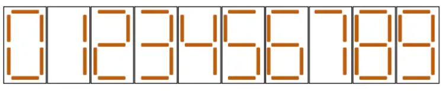

> 小 S 喜欢收集小木棍。在收集了 $n$ 根长度相等的小木棍之后，他闲来无事，便用它们拼起了数字。用小木棍拼每种数字的方法如下图所示。
>
> 
>
> 现在小 S 希望拼出一个**正**整数，满足如下条件：
>
> - 拼出这个数**恰好**使用 $n$ 根小木棍；
> - 拼出的数没有前导 $0$；
> - 在满足以上两个条件的前提下，这个数尽可能小。
>
> 小 S 想知道这个数是多少，可 $n$ 很大，把木棍整理清楚就把小 S 折腾坏了，所以你需要帮他解决这个问题。如果不存在正整数满足以上条件，你需要输出 $-1$ 进行报告。
>
> **输入格式**
>
> 本题有多组测试数据。
>
> 输入的第一行包含一个正整数 $T$，表示数据组数。
>
> 接下来包含 $T$ 组数据，每组数据的格式如下：
>
> 一行包含一个整数 $n$，表示木棍数。
>
> **输出格式**
>
> 对于每组数据：输出一行，如果存在满足题意的正整数，输出这个数；否则输出 $-1$。
>
> **样例**
>
> **输入样例 1**
>
> ```
> 5
> 1
> 2
> 3
> 6
> 18
> ```
>
> 输出样例 1
>
> ```
> -1
> 1
> 7
> 6
> 208
> ```
>
> **样例 1 解释**
>
> - 对于第一组测试数据，不存在任何一个正整数可以使用恰好一根小木棍摆出，故输出 $-1$。
>- 对于第四组测试数据，注意 $0$ 并不是一个满足要求的方案。摆出 $9$、$41$ 以及 $111$ 都恰好需要 $6$ 根小木棍，但它们不是摆出的数最小的方案。
> - 对于第五组测试数据，摆出 $208$ 需要 $5 + 6 + 7 = 18$ 根小木棍。可以证明摆出任何一个小于 $208$ 的正整数需要的小木棍数都不是 $18$。注意尽管拼出 $006$ 也需要 $18$ 根小木棍，但因为这个数有前导零，因此并不是一个满足要求的方案。
> 
> **数据范围**
>
> 对于所有测试数据，保证：$1 \leq T \leq 50$，$1 \leq n \leq 10^5$。
>
> | 测试点编号 | $n\leq$ | 特殊性质 |
>| :--------: | :-----: | :------: |
> |    $1$     |  $20$   |    无    |
>|    $2$     |  $50$   |    ^     |
> |    $3$     | $10^3$  |    A     |
> |   $4,5$    | $10^5$  |    ^     |
> |    $6$     | $10^3$  |    B     |
> |   $7,8$    | $10^5$  |    ^     |
> |    $9$     | $10^3$  |    无    |
> |    $10$    | $10^5$  |    ^     |
> 
> 特殊性质 A：保证 $n$ 是 $7$ 的倍数且 $n \geq 100$。
> 
> 特殊性质 B：保证存在整数 $k$ 使得 $n = 7k + 1$，且 $n \geq 100$。

题目要求用**恰好** $n$ 根木棍拼出一个**没有前导零**的**最小**正整数。

我们先列出拼出数字 $0 \sim 9$ 分别需要的木棍数量：

- `0`: 6根，`1`: 2根，`2`: 5根，`3`: 5根，`4`: 4根
- `5`: 5根，`6`: 6根，`7`: 3根，`8`: 7根，`9`: 6根

## 核心分析与贪心策略

要让拼出的数字尽可能小，我们有两个最高优先级的贪心策略：

1. **位数越少，数字越小**：因此我们要让每位数字消耗的木棍尽可能多。消耗木棍最多的数字是 `8`（需要 7 根）。所以，我们要**尽可能多地使用数字 `8`**。
2. **高位数字越小，数字越小**：在位数相同的情况下，最高位（最左边）的数字越小，整个数就越小。

基于“尽可能多用 `8`”的原则，我们可以把 $n$ 对 $7$ 取模（即 $n \pmod 7$），根据余数来决定最高位或前几位的数字组合。

## 分类讨论

一个数字如果完全由 `8` 组成，木棍数就是 $7$ 的倍数。当 $n$ 不是 $7$ 的倍数时，余数会有 $1 \sim 6$ 共 6 种情况。我们可以对余数进行分类讨论。

对于较大的 $n$（例如 $n \ge 14$），后面可以全部填 `8`，我们只需要搞定最前面的几位数：

- **余 0**：最完美，全部填 `8`。
- **余 1**：拿出 1 根，并从后面借 1 个 `8`（7根），凑成 8 根木棍，拼出最小两位数 **`10`**。
- **余 2**：多出 2 根，直接在最高位放 **`1`**。
- **余 3**：拿出 3 根，并从后面借 2 个 `8`（14根），凑成 17 根木棍，拼出最小三位数 **`200`**。
- **余 4**：拿出 4 根，并从后面借 1 个 `8`（7根），凑成 11 根木棍，拼出最小两位数 **`20`**。
- **余 5**：多出 5 根，直接在最高位放 **`2`**。
- **余 6**：多出 6 根，直接在最高位放 **`6`**（因为不能有前导零，所以不用 `0`）。

## 小数据特判

对于 $n \le 13$ 的较小情况，由于木棍太少，无法通过“借一个8”的方式自由组合，我们需要直接硬性特判（打表）：

- $n = 1$: 没有任何数字只需 1 根木棍 $\implies$ 输出 `-1`
- $n = 2 \implies 1$
- $n = 3 \implies 7$
- $n = 4 \implies 4$
- $n = 5 \implies 2$
- $n = 6 \implies 6$ （注意样例解释：摆出 `0` 不合法，摆出 `9`、`41`、`111` 都不是最小，最小是 `6`）
- $n = 7 \implies 8$
- $n = 8 \implies 10$
- $n = 9 \implies 18$
- $n = 10 \implies 22$
- $n = 11 \implies 20$
- $n = 12 \implies 28$
- $n = 13 \implies 68$

## 代码实现 (C++)

```c++
#include <iostream>
#include <string>

void solve() {
    int n;
    std::cin >> n;

    // 对 n <= 13 的较小情况进行打表特判
    if (n <= 13) {
        switch (n) {
            case 1:  std::cout << -1 << "\n"; break;
            case 2:  std::cout << 1 << "\n";  break;
            case 3:  std::cout << 7 << "\n";  break;
            case 4:  std::cout << 4 << "\n";  break;
            case 5:  std::cout << 2 << "\n";  break;
            case 6:  std::cout << 6 << "\n";  break;
            case 7:  std::cout << 8 << "\n";  break;
            case 8:  std::cout << 10 << "\n"; break;
            case 9:  std::cout << 18 << "\n"; break;
            case 10: std::cout << 22 << "\n"; break;
            case 11: std::cout << 20 << "\n"; break;
            case 12: std::cout << 28 << "\n"; break;
            case 13: std::cout << 68 << "\n"; break;
        }
        return;
    }

    int k = n / 7;
    int remainder = n % 7;

    switch (remainder) {
        case 0:
            std::cout << std::string(k, '8') << "\n";
            break;
        case 1:
            std::cout << "10" << std::string(k - 1, '8') << "\n";
            break;
        case 2:
            std::cout << "1" << std::string(k, '8') << "\n";
            break;
        case 3:
            std::cout << "200" << std::string(k - 2, '8') << "\n";
            break;
        case 4:
            std::cout << "20" << std::string(k - 1, '8') << "\n";
            break;
        case 5:
            std::cout << "2" << std::string(k, '8') << "\n";
            break;
        case 6:
            std::cout << "6" << std::string(k, '8') << "\n";
            break;
    }
}

int main() {
    std::ios_base::sync_with_stdio(false);
    std::cin.tie(nullptr);

    int t;
    if (std::cin >> t) {
        while (t--) {
            solve();
        }
    }
    return 0;
}
```

