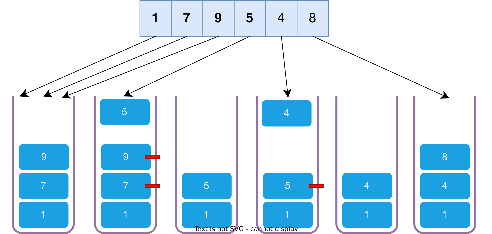
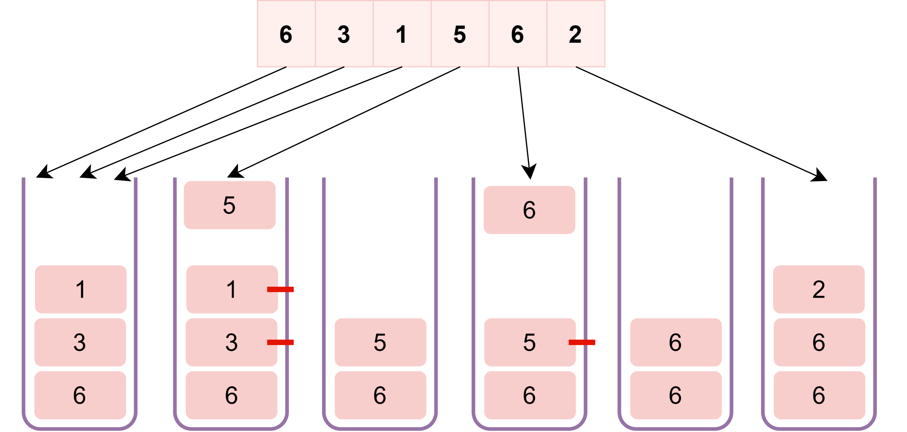

单调栈 (Monotonic Stack)是一种特殊的栈数据结构。它与普通栈的区别在于：**栈内的元素始终保持单调递增或单调递减的顺序。**

通过这种特殊的约束，单调栈可以在处理“寻找离当前元素最近的满足某种条件（如比自身大或小）的元素”这类问题时，将时间复杂度降低到 $O(n)$。

## 核心逻辑

单调栈的操作遵循“先进后出”，但在压栈（push）时，为了维持单调性，需要进行必要的弹出（pop）操作：


### 单调递增栈

栈内元素始终保持**从小到大**的顺序（栈底最小，栈顶最大）。当新元素入栈时，若其小于或等于栈顶元素，则不断弹出栈顶，直到满足递增条件为止。

该结构的主要用途是**寻找数组中左侧第一个比当前元素小的数**。入栈流程完成后，栈顶即为该目标的最终结果。



### 单调递减栈

栈内元素始终保持**从大到小**的顺序（栈底最大，栈顶最小）。当新元素入栈时，若其大于或等于栈顶元素，则不断弹出栈顶，直到满足递减条件为止。

该结构的主要用途是**寻找数组中左侧第一个比当前元素大的数**。入栈流程完成后，栈顶即为该目标的最终结果。



## C++ 实现推荐

在实际的 C++ 开发中，开发者通常直接使用 `std::stack` 或 `std::vector` 来模拟单调栈的行为。

虽然 `std::stack` 也可以，但由于我们需要在逻辑中访问“栈底”或进行遍历，**`std::vector` 往往是更优的选择**。它不仅功能更强，还能提供更好的内存局部性（cache locality）。

```c++
#include <iostream>
#include <vector>

/**
 * 实现功能：寻找数组中每个元素左侧第一个比它小的元素
 * 如果不存在，则返回 -1
 * 时间复杂度：O(n) - 每个元素最多进栈一次，出栈一次
 * 空间复杂度：O(n) - 最坏情况栈内存储所有元素
 */
std::vector<int> getPreviousSmaller(const std::vector<int>& nums) {
    int n = nums.size();
    std::vector<int> result;
    // 使用 std::vector 作为栈，因为它在内存中连续，性能更好
    std::vector<int> stack;

    // 预留空间可以减少动态扩容带来的开销
    result.reserve(n);

    for (int x : nums) {
        // 单调递增栈的核心：
        // 在压栈前，确保栈顶元素小于当前元素 x。
        // 如果栈顶 >= x，说明栈顶元素不可能是我们找的“左侧更小值”，弹出它。
        while (!stack.empty() && stack.back() >= x) {
            stack.pop_back();
        }

        // 处理结果：
        if (stack.empty()) {
            // 栈为空，说明左侧没有比 x 更小的元素
            result.push_back(-1);
        } else {
            // 此时栈顶即为左侧第一个比 x 小的元素
            result.push_back(stack.back());
        }

        // 将当前元素压入栈中，维持单调递增性
        stack.push_back(x);
    }

    return result;
}
```

## 为什么栈内元素“不完整”却依然正确？

这是理解单调栈的“瓶颈”。其实，单调栈本质上是一个“优胜劣汰的竞争名单”：

当我们遍历数组时，新元素会不断入栈。如果新元素比栈顶小，栈顶那些“过大且靠左”的元素就会被弹出。这种舍弃机制之所以安全，是因为：

1. **更优的竞争力**：新元素既比那些被弹出的“大元素”更小，位置又更靠右。
2. **功能的覆盖**：对于后续的任何数字来说，比起那些“老去”的大元素，新元素显然是更近、更优的候选边界。

**结论**：被弹出的元素并非“丢失”，而是它们在竞争中由于不再具备成为“最近边界”的价值而完成了使命。栈内最终留下的“幸存者”，恰好就是我们寻找答案所需的全部关键信息。

## 性能优势

- **时间复杂度**：$O(n)$。虽然有 `while` 循环，但每个元素一生中只会进栈一次、出栈一次。
- **空间复杂度**：$O(n)$。在最差情况下（数组本身有序），栈内可能存储所有元素。

## 典型应用场景

1. **每日温度问题**：给定一组温度，求每一天之后第一个比它高的温度出现在几天后。
2. **柱状图中最大的矩形**：利用单调栈寻找左右两侧第一个比当前高度小的柱子，从而确定该柱子作为高度时能延伸的宽度。
3. **接雨水问题**：利用单调递减栈寻找左右两侧的边界来计算中间凹槽积水量。