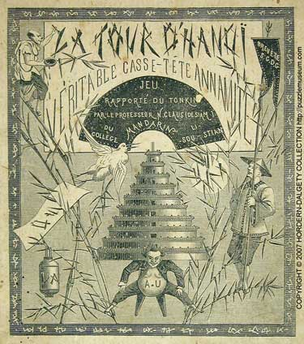

汉诺塔（Tower of Hanoi）是一个经典的数学谜题，它由法国数学家爱德华·卢卡斯（Édouard Lucas）于1883年发明，背后还伴随着一个古老的传说：印度一座神庙里的僧侣们在移动64个金盘，当他们把所有盘子按规则从一根柱子移到另一根柱子时，世界就会在一瞬间毁灭。



## 游戏规则

汉诺塔的结构非常简单：有三根柱子（暂且称为 A、B、C）和几片大小不一的圆盘。游戏开始时，所有圆盘在 A 柱上按**从大到小**的顺序叠放，形成一个金字塔状。

你的目标是**把所有的圆盘移动到 C 柱上**，但在移动过程中必须遵守以下三个严苛的规则：

1. **每次只能移动一片圆盘**（只能取走某根柱子最顶端的盘子）。
2. **大盘子绝对不能放在小盘子上面**。
3. 移动过程中，圆盘可以临时存放在任意一根柱子上。

👉 **[在线汉诺塔游戏：亲自动手试一试](https://gallery.selfboot.cn/zh/algorithms/hanoitower)**

## 核心思维：如何用“递归”拆解它？

如果直接去想每一步怎么走，当盘子变多时，人类的肉脑很容易打结。计算机科学家之所以喜欢汉诺塔，是因为它能完美展现“把宏大问题化小”的递归思维。

假设我们要把 $n$ 个盘子从 A 移到 C（借助 B）：

1. **第 1 步：** 先设法把上面 $n-1$ 个盘子，从 A 移到 B（借助 C）。
2. **第 2 步：** 此时 A 柱只剩最大的那个盘子，直接把它移到 C。
3. **第 3 步：** 最后，把刚才挪到 B 的那 $n-1$ 个盘子，从 B 移到 C（借助 A）。

看，原本是 $n$ 个盘子的大难题，被拆成了**两个“移动 $n-1$ 个盘子”的子问题**。只要一直这样拆下去，直到剩下 1 个盘子（也就是递归的边界），问题就迎刃而解了。

## 代码实现 (C++)

```c++
#include <iostream>

/**
 * 汉诺塔核心递归实现
 * @param n     当前需要移动的盘子数量
 * @param from  起始柱
 * @param b     辅助柱
 * @param to    目标柱
 */
void hanoi(int n, char from, char b, char to) {
    // 边界条件：只有一个盘子时，直接从起始柱移到目标柱
    if (n == 1) {
        std::cout << "将圆盘 1 从 " << from << " 移动到 " << to << "\n";
        return;
    }

    // 1. 将上面的 n-1 个盘子从 from 移到 b（借助 to）
    hanoi(n - 1, from, to, b);

    // 2. 将最底下的第 n 个大盘子从 from 移到 to
    std::cout << "将圆盘 " << n << " 从 " << from << " 移动到 " << to << "\n";

    // 3. 将刚才挪到 b 的 n-1 个盘子从 b 移到 to（借助 from）
    hanoi(n - 1, b, from, to);
}
```

