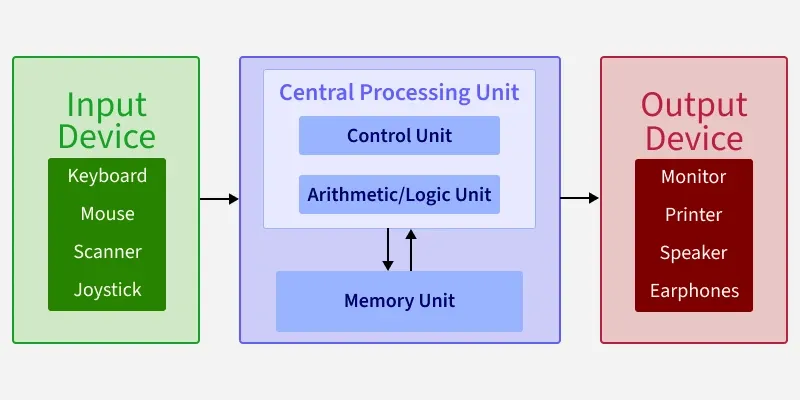
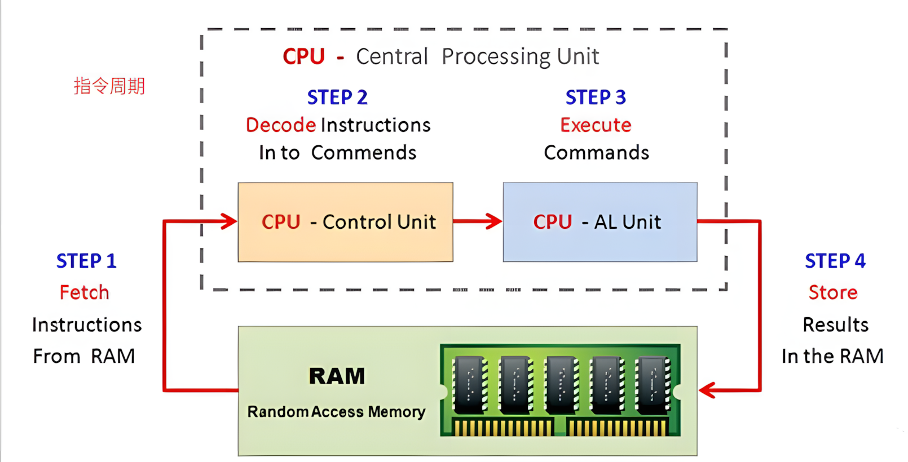

**冯·诺依曼结构（Von Neumann Architecture）**，也被称为**存储程序计算机模型**，是由美籍匈牙利科学家约翰·冯·诺依曼于1945年提出的。这一结构奠定了现代通用计算机的理论基础，直到今天，我们使用的智能手机、个人电脑和服务器，绝大多数依然沿用这一基本架构。

## 核心设计思想

冯·诺依曼结构最核心的突破在于“存储程序”思想，其主要包含以下几个关键点：

- **存储程序控制**：数字计算机的程序（指令序列）和数据一样，都存放在同个存储器中。计算机能够自动从存储器中依次取出指令并执行，无需人工干预。
- **二进制数制**：计算机内部采用二进制（0和1）来表示指令和数据。
- **顺序执行**：在没有遇到跳转指令的情况下，计算机按照指令在存储器中的排列顺序，依次执行程序。

## 五大核心组成部分

冯·诺依曼结构将计算机硬件系统划分为五个核心部分，它们各司其职、协同工作：

### 运算器（Arithmetic Logic Unit, ALU）

运算器是计算机的数据加工厂，专门负责执行各类算术运算与逻辑判断，是处理信息的核心动力。

### 控制器（Control Unit, CU）

控制器充当着计算机的“大脑”与指挥中心，它负责从存储器中提取指令并对其进行解析，随后向其他硬件发出操作指令。

:::note 
现代计算机中，**运算器**和**控制器**通常被集成在一起，构成了我们熟知的**中央处理器（CPU）**。
:::

### 存储器（Memory）

**存储器**是系统的统一存储单元，负责存放程序指令与处理数据。在冯·诺依曼结构中，指令与数据在存储形式上没有本质区别，它们被混合存储在同一个编址空间内，并共用同一组总线进行传输与存取。

为了优化性能，现代计算机采用了层次化的存储体系：从位于 CPU 内部、速度极快的**寄存器**，到负责缓解处理瓶颈的**高速缓存（Cache）**，再到存放当前运行程序和数据的**主存储器（内存/RAM）**，以及用于长期保存数据、具有非易失性的**外存储器**（如硬盘/SSD）。这种分层架构通过将常用的数据向上级存储迁移，从而平衡了存取速度与存储容量之间的矛盾。

### 输入设备（Input Device）

**输入设备**作为人机交互的入口，负责将文字、图像或声音等现实信息转化为计算机可理解的二进制代码。

### 输出设备（Output Device）

**输出设备**则是结果的展示窗口，它将计算机内部处理好的二进制数据，转换为人类或其他设备能够感知与识别的形式，例如屏幕显示或声音输出。

## 计算机的工作周期

基于冯·诺依曼结构，计算机在执行程序时会不断重复以下四个基本步骤（通常称为**指令周期**）：

1. **取指令（Fetch）**：控制器根据程序计数器（PC）中的地址，从存储器中取出一条指令。
2. **指令译码（Decode）**：控制器对取出的指令进行分析，弄清这条指令要执行什么操作。
3. **执行指令（Execute）**：控制器指挥运算器或其他部件去执行指令所要求的具体操作（例如两个数相加）。
4. **写回结果（Writeback）**：将执行结果保存到寄存器或主存储器中，然后程序计数器指向下一条指令。

**冯·诺依曼结构**通过“存储程序”这一开创性理念，彻底改变了计算机的设计方式。它将程序指令与处理数据统一存储在内存中，并由中央处理器按顺序循环执行，这种简洁且高效的设计逻辑构成了现代计算机的通用范式。

尽管该结构因指令与数据共用总线而存在“瓶颈”制约，但其高度的灵活性和可编程性，依然是推动计算技术从科研实验室走向个人普及的核心动力。时至今日，我们使用的所有计算设备，其本质依然是在这一经典的架构基础上进行演进与优化。